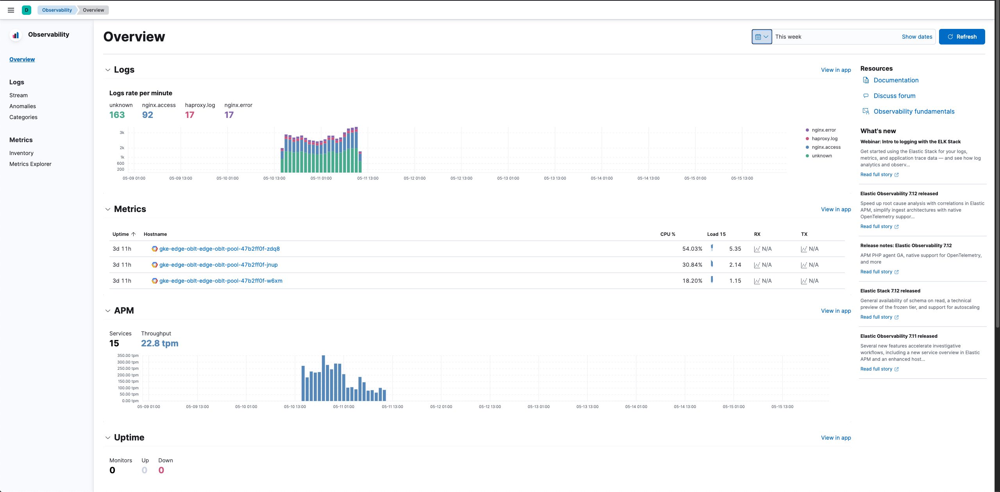

## Overview

Observability solutions can register their navigation structures via the Observability plugin, this ensures that these navigation options display in the Observability page template component. This is a two part process, A) register your navigation structure and B) consume and render the shared page template component. These two elements are documented below.

## Navigation registration

To register a solution's navigation structure you'll first need to ensure your solution has the observability plugin specified as a dependency in your `kibana.json` file, e.g.

```json
"requiredPlugins": [
    "observability"    
],
```

Now within your solution's **public** plugin `setup` lifecycle method you can
call the `registerSections` method, this will register your solution's specific
navigation structure with the overall Observability navigation registry.

The `registerSections` function takes an `Observable` of an array of
`NavigationSection`s. Each section can be defined as

```typescript
export interface NavigationSection {
  // the label of the section, should be translated
  label: string | undefined;
  // the key to sort by in ascending order relative to other entries
  sortKey: number;
  // the entries to render inside the section
  entries: NavigationEntry[];
}
```

Each entry inside of a navigation section is defined as

```typescript
export interface NavigationEntry {
  // the label of the menu entry, should be translated
  label: string;
  // the kibana app id
  app: string;
  // the path after the application prefix corresponding to this entry
  path: string;
  // whether to only match when the full path matches, defaults to `false`
  matchFullPath?: boolean;
  // whether to ignore trailing slashes, defaults to `true`
  ignoreTrailingSlash?: boolean;
  // the label of the badge that is shown besides the navigation label
  sideBadgeLabel?: string;
}
```

A registration might therefore look like the following:

```typescript
// x-pack/plugins/example_plugin/public/plugin.ts

import { of } from 'rxjs';

export class Plugin implements PluginClass {
  constructor(_context: PluginInitializerContext) {}

  setup(core: CoreSetup, plugins: PluginsSetup) {
    plugins.observability.navigation.registerSections(
      of([
        {
          label: 'A solution section',
          sortKey: 200,
          entries: [
            { label: 'Home Page', app: 'exampleA', path: '/', matchFullPath: true },
            { label: 'Example Page', app: 'exampleA', path: '/example' },
            { label: 'Another Example Page', app: 'exampleA', path: '/another-example' },
          ],
        },
        {
          label: 'Another solution section',
          sortKey: 300,
          entries: [
            { label: 'Example page', app: 'exampleB', path: '/example' },
          ],
        },
      ])
    );
  }

  start() {}

  stop() {}
}
```

Here `app` would match your solution - e.g. logs, metrics, APM, uptime etc. The registry is fully typed so please refer to the types for specific options.

Observables are used to facilitate changes over time, for example within the lifetime of your application a license type or set of user permissions may change and as such you may wish to change the navigation structure. If your navigation needs are simple you can pass a value and forget about it. **Solutions are expected to handle their own permissions, and what should or should not be displayed at any time**, the Observability plugin will not add and remove items for you.

The Observability navigation registry is now aware of your solution's navigation needs ✅

## Page template component

The shared page template component can be used to actually display and render all of the registered navigation structures within your solution.

The `start` contract of the public Observability plugin exposes a React component, under `navigation.PageTemplate`.

This can be accessed like so:

```
const [coreStart, pluginsStart] = await core.getStartServices();
const ObservabilityPageTemplate = pluginsStart.observability.navigation.PageTemplate;
```

Now that you have access to the component you can render your solution's content using it.

```jsx
 <ObservabilityPageTemplate
    pageHeader={{
        pageTitle: SolutionPageTitle,
        rightSideItems: [
            // Just an example
            <DatePicker
            rangeFrom={relativeTime.start}
            rangeTo={relativeTime.end}
            refreshInterval={refreshInterval}
            refreshPaused={refreshPaused}
            />,
        ],
    }}
    >
    // Render anything you like here, this is just an example.
    <EuiFlexGroup>
        <EuiFlexItem>
            // Content
        </EuiFlexItem>

        <EuiFlexItem>
            // Content
        </EuiFlexItem>
    </EuiFlexGroup>
</ObservabilityPageTemplate>
```

The `<ObservabilityPageTemplate />` component is a wrapper around the `<KibanaPageTemplate />` component (which in turn is a wrapper around the `<EuiPageTemplate>` component). As such the props mostly reflect those available on the wrapped components, again everything is fully typed so please refer to the types for specific options. The `pageSideBar` prop is handled by the component, and will take care of rendering out and managing the items from the registry.

After these two steps we should see something like the following (note the navigation on the left):



## Adding badge

You can add a badge beside the label by using the property `sideBadgeLabel?: string`.

```js
setup(core: CoreSetup, plugins: PluginsSetup) {
    plugins.observability.navigation.registerSections(
      of([
        {
          label: 'A solution section',
          sortKey: 200,
          entries: [
            { label: 'Backends', app: 'exampleA', path: '/example', sideBadgeLabel: 'NEW'  },
          ],
        }
      ])
    );
  }

```


The badge is going to be shown until user clicks on the menu item for the first time. Then we'll save an information at local storage, following this pattern `observability.nav_item_badge_visible_${app}${path}`, the above example would save `observability.nav_item_badge_visible_exampleA/example`. And the badge is removed. It'll only show again if the item saved at local storage is removed or set to `false`.

It's recommended to remove the badge (e.g. a new feature promotion) in the subsequent release.

To avoid the navigation flooding with badges, we also want to propose keeping it to maximum 2 active badges for every iteration


